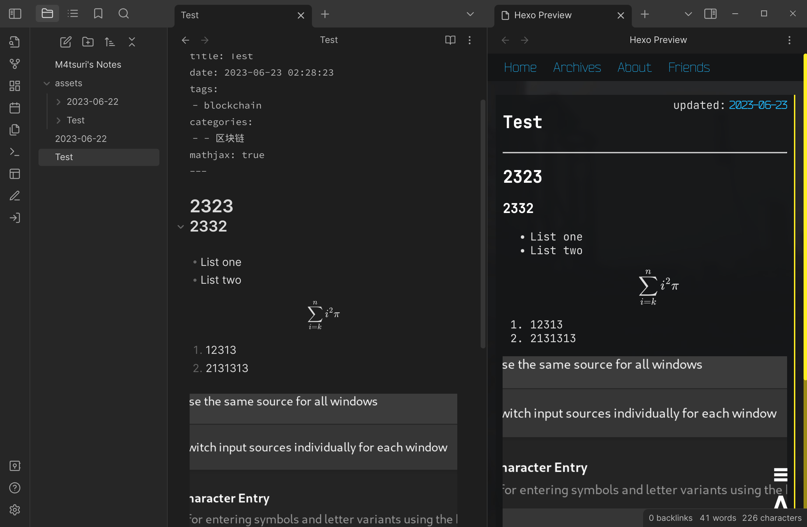

# Obsidian Hexo Helper

This is a helper script to help previewing and publishing to hexo site in Obsidian.

## Dependency 

- nodejs, npm, npx (I'm using node@18)
- [obsidian-custom-attachment-location](https://github.com/RainCat1998/obsidian-custom-attachment-location) plugin

## Usage

Fill requirements in hexo helper's settings and keep settings of obsidian-custom-attachment-location default.

Click the pencil icon on the sidebar to start previewing.

Current only previewing is tested.

